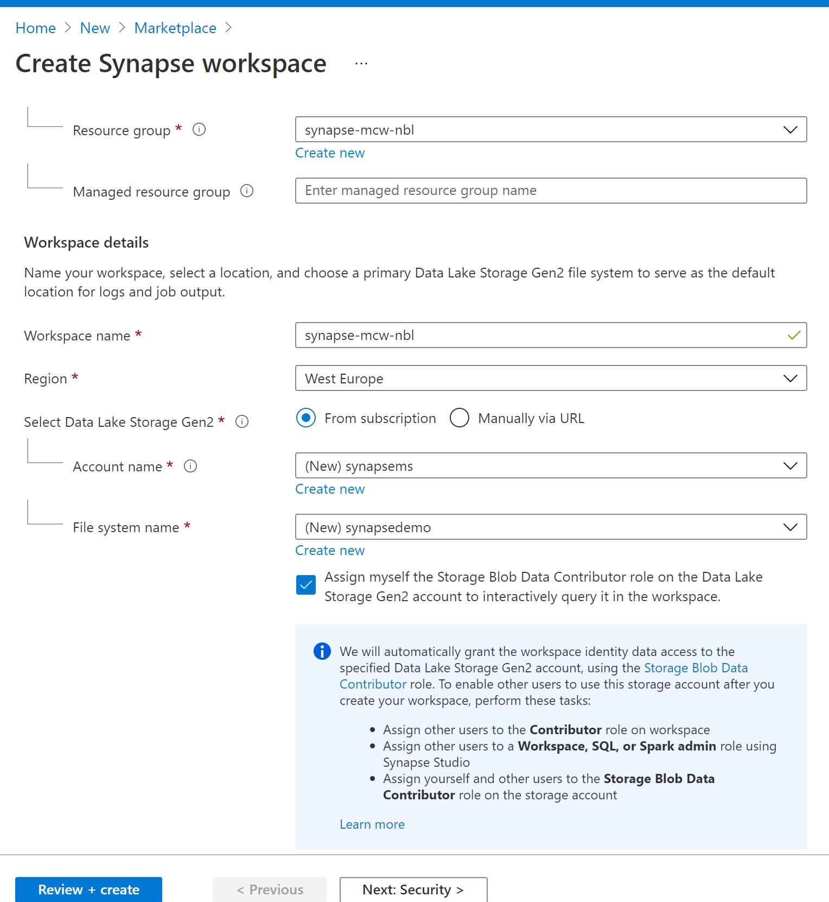
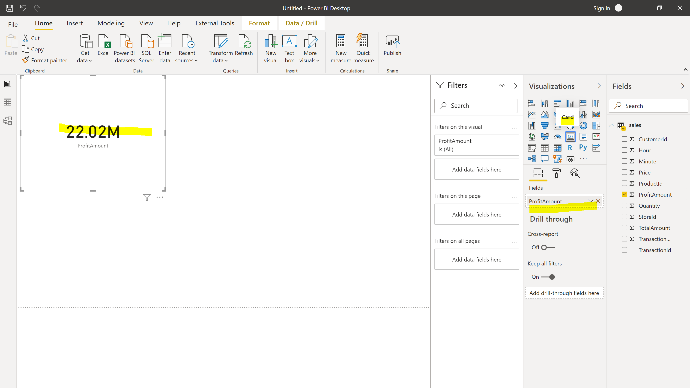

<div class="MCWHeader1">
Azure Synapse Analytics and AI
</div>

<div class="MCWHeader2">
Hands-on lab step-by-step
</div>

<div class="MCWHeader3">
October 2020
</div>


Information in this document, including URL and other Internet Web site references, is subject to change without notice. Unless otherwise noted, the example companies, organizations, products, domain names, e-mail addresses, logos, people, places, and events depicted herein are fictitious, and no association with any real company, organization, product, domain name, e-mail address, logo, person, place or event is intended or should be inferred. Complying with all applicable copyright laws is the responsibility of the user. Without limiting the rights under copyright, no part of this document may be reproduced, stored in or introduced into a retrieval system, or transmitted in any form or by any means (electronic, mechanical, photocopying, recording, or otherwise), or for any purpose, without the express written permission of Microsoft Corporation.

Microsoft may have patents, patent applications, trademarks, copyrights, or other intellectual property rights covering subject matter in this document. Except as expressly provided in any written license agreement from Microsoft, the furnishing of this document does not give you any license to these patents, trademarks, copyrights, or other intellectual property.

The names of manufacturers, products, or URLs are provided for informational purposes only and Microsoft makes no representations and warranties, either expressed, implied, or statutory, regarding these manufacturers or the use of the products with any Microsoft technologies. The inclusion of a manufacturer or product does not imply endorsement of Microsoft of the manufacturer or product. Links may be provided to third party sites. Such sites are not under the control of Microsoft and Microsoft is not responsible for the contents of any linked site or any link contained in a linked site, or any changes or updates to such sites. Microsoft is not responsible for webcasting or any other form of transmission received from any linked site. Microsoft is providing these links to you only as a convenience, and the inclusion of any link does not imply endorsement of Microsoft of the site or the products contained therein.

© 2020 Microsoft Corporation. All rights reserved.

Microsoft and the trademarks listed at <https://www.microsoft.com/en-us/legal/intellectualproperty/Trademarks/Usage/General.aspx> are trademarks of the Microsoft group of companies. All other trademarks are property of their respective owners.

**Contents** 

<!-- TOC -->
- [Azure Synapse Analytics and AI hands-on lab step-by-step](#azure-synapse-analytics-and-ai-hands-on-lab-step-by-step)
  - [Abstract and learning objectives](#abstract-and-learning-objectives)
  - [Overview](#overview)
  - [Solution architecture](#solution-architecture)
  - [Requirements](#requirements)
  - [Before the hands-on lab](#before-the-hands-on-lab)
  - [Resource naming throughout this lab](#resource-naming-throughout-this-lab)
  - [Exercise 1: Accessing the Azure Synapse Analytics workspace](#exercise-1-accessing-the-azure-synapse-analytics-workspace)
    - [Task 1: Create synapse Workspace](#task-1-launching-synapse-studio)
    - [Task 2: Launching Synapse Studio](#task-1-launching-synapse-studio)
  - [Exercise 2: Create and populate the supporting tables in the SQL Pool](#exercise-2-create-and-populate-the-supporting-tables-in-the-sql-pool)
    - [Task 1: Create the customer information table](#task-3-create-the-customer-information-table)
    - [Task 2: Populate the customer information table](#task-4-populate-the-customer-information-table)
    - [Task 3: Create the campaign analytics table](#task-5-create-the-campaign-analytics-table)
    - [Task 4: Populate the campaign analytics table](#task-6-populate-the-campaign-analytics-table)
    - [Task 5: Create the sale table](#task-1-create-the-sale-table)
    - [Task 6: Populate the sale table](#task-2-populate-the-sale-table)
  - [Exercise 3: Exploring raw parquet](#exercise-3-exploring-raw-parquet)
    - [Task 1: Query sales Parquet data with Synapse SQL Serverless](#task-1-query-sales-parquet-data-with-synapse-sql-serverless)
    - [Task 2: Query sales Parquet data with Azure Synapse Spark](#task-2-query-sales-parquet-data-with-azure-synapse-spark)
  - [Exercise 4: Publish PowerBI Report](#exercise-5-synapse-pipelines-and-cognitive-search-optional)
    - [Task 1: Create the PowerBI Report using Synapse Serverless ](#task-1-create-the-invoice-storage-container)
    - [Task 2: Publish the report](#task-2-create-and-train-an-azure-forms-recognizer-model-and-setup-cognitive-search)
  - [Exercise 5: Purview (Optional)](#exercise-6-security)
    - [Task 1: Create Purview](#task-1-column-level-security)
    - [Task 2: Link Synapse workspace to purview](#task-2-row-level-security)
    - [Task 3: Browse Catalog and explore ](#task-3-dynamic-data-masking)

  - [After the hands-on lab](#after-the-hands-on-lab)
    - [Task 1: Delete the resource group](#task-1-delete-the-resource-group)
<!-- /TOC -->

# Azure Synapse Analytics and AI hands-on lab step-by-step

## Abstract and learning objectives

In this hands-on-lab, you will build an end-to-end data analytics  using Azure Synapse Analytics. The information will be presented in the context of a retail scenario. We will be heavily leveraging Azure Synapse Studio, a tool that conveniently unifies the most common data operations from ingestion, transformation, querying, and visualization.

## Overview

In this lab various features of Azure Synapse Analytics will be explored. Azure Synapse Analytics Studio is a single tool that every team member can use collaboratively. Synapse Studio will be the only tool used throughout this lab through data ingestion, cleaning, and transforming raw files to using Notebooks to train, register, and consume a Machine learning model. The lab will also provide hands-on-experience monitoring and prioritizing data related workloads.

## Solution architecture


This lab explores the cold data scenario of ingesting various types of raw data files. These files can exist anywhere. The file types used in this lab are CSV, parquet, and JSON. This data will be ingested into Synapse Analytics via Pipelines. From there, the data can be transformed and enriched using various tools such as data flows, Synapse Spark, and Synapse SQL (both provisioned and serverless). Once processed, data can be queried using Synapse SQL tooling. Azure Synapse Studio also provides the ability to author notebooks to further process data, create datasets, train, and create machine learning models. These models can then be stored in a storage account or even in a SQL table. These models can then be consumed via various methods, including T-SQL. The foundational component supporting all aspects of Azure Synapse Analytics is the ADLS Gen 2 Data Lake.

## Requirements

1. Microsoft Azure subscription

2. Azure Synapse Workspace / Studio
 
3. [Ensure the Microsoft.Sql resource provider is registered in your Azure Subscription](https://docs.microsoft.com/en-us/azure/azure-resource-manager/management/resource-providers-and-types). 

## Before the hands-on lab


## Resource naming throughout this lab

For the remainder of this lab, the following terms will be used for various ASA (Azure Synapse Analytics) related resources (make sure you replace them with actual names and values from your environment):

| Azure Synapse Analytics Resource  | To be referred to                                                                  |
|-----------------------------------|------------------------------------------------------------------------------------|
| Azure Subscription                | `WorkspaceSubscription`                                                            |
| Azure Region                      | `WorkspaceRegion`                                                                  |
| Workspace resource group          | `WorkspaceResourceGroup`                                                           |
| Workspace / workspace name        | `asaworkspace{suffix}`                                                             |
| Primary Storage Account           | `asadatalake{suffix}`                                                              |
| Default file system container     | `DefaultFileSystem`                                                                |
| SQL Pool                          | `SqlPool01`                                                                        |
| SQL Serverless Endpoint           | `SqlServerless01`                                                                  |
| Azure Key Vault                   | `asakeyvault{suffix}`                                                              |
| Initial Suffix                    | `Initial{suffix}`
## Exercise 1: Accessing the Azure Synapse Analytics workspace

**Duration**: 15 minutes

All exercises in this lab utilize the workspace Synapse Studio user interface. This exercise will outline the steps to launch Synapse Studio. Unless otherwise specified, all instruction including menu navigation will occur in Synapse Studio.

### Task 1: Create Azure Synapse Workspace

1. Login into the Azure Portal
2. Create a resource group Synapse-MCW-`Initial{suffix}`
3. Select Region as West Europe and click review and create
    
4. Once the resource group is created, the next step is to create **Synapse Workspace** resource 
5. Go to Create Resource and search for **Azure Synapse Analytics**
    
7. On the resource creation page, select `WorkspaceResourceGroup` that was created as a part of  step 3.
8. Provide a unique workspace name `asaworkspace{suffix}`
9. Select Region as West Europe
10. Click create new Create a new storage account `asadatalake{suffix}` and file system name `DefaultFileSystem` .

   

10. Click security and Provide SQLAdminuser Name password. Eg:Password@123456789.
11. Click Review and Create. It will take usually 5-6 minutes to create the workspace.

12. Once the workspace is created, observe the synapse settings. Next step, is to create SQL Pool

13. Click on SQL Pool, Click new  and provide the Pool Name as `SqlPool01` . Select DWU500 and rest to default. 
14.  Click review and create.


### Task 2: Launching Synapse Studio

1. Log into the [Azure Portal](https://portal.azure.com).

2. Expand the left menu, and select the **Resource groups** item.
  
    

3. From the list of resource groups, select `WorkspaceResourceGroup`.
  
4. From the list of resources, select the **Synapse Workspace** resource, `asaworkspace{suffix}`.
  
    

5. On the **Overview** tab of the Synapse Workspace page, select the **Launch Synapse Studio** item from the top toolbar. Alternatively you can select the Workspace web URL link.

    

## Exercise 2: Create and populate the supporting tables in the SQL Pool

**Duration**: 120 minutes

The first step in querying meaningful data is to create tables to house the data. In this case, we will create four different tables: SaleSmall, CustomerInfo, CampaignAnalytics, and Sales. When designing tables in Azure Synapse Analytics, we need to take into account the expected amount of data in each table, as well as how each table will be used. Utilize the following guidance when designing your tables to ensure the best experience and performance.

Table design performance considerations

| Table Indexing | Recommended use |
|--------------|-------------|
| Clustered Columnstore | Recommended for tables with greater than 100 million rows, offers the highest data compression with best overall query performance. |
| Heap Tables | Smaller tables with less than 100 million rows, commonly used as a staging table prior to transformation. |
| Clustered Index | Large lookup tables (> 100 million rows) where querying will only result in a single row returned. |
| Clustered Index + non-clustered secondary index | Large tables (> 100 million rows) when single (or very few) records are being returned in queries. |

| Table Distribution/Partition Type | Recommended use |
|--------------------|-------------|
| Hash distribution | Tables that are larger than 2 GBs with infrequent insert/update/delete operations, works well for large fact tables in a star schema. |
| Round robin distribution | Default distribution, when little is known about the data or how it will be used. Use this distribution for staging tables. |
| Replicated tables | Smaller lookup tables, less than 1.5 GB in size. |

### Task 1: Create the customer information table

Over the past 5 years, Wide World Importers has amassed over 3 billion rows of sales data. With this quantity of data, the customer information lookup table is estimated to have over 100 million rows but will consume less than 1.5 GB of storage. While we will be using only a subset of this data for the lab, we will design the table for the production environment. Using the guidance outlined in the Exercising description, we can ascertain that we will need a **Clustered Columnstore** table with a **Replicated** table distribution to hold customer data.


1. Expand the left menu and select the **Develop** item. From the **Develop** blade, expand the **+** button and select the **SQL script** item.

    

2. In the query tab toolbar menu, ensure you connect to your SQL Pool, `SQLPool01`.

    

3. In the query window, copy and paste the following query to create the customer information table. Then select the **Run** button in the query tab toolbar.
  
   ```sql
    CREATE SCHEMA wwi_mcw 
     GO
 
    CREATE TABLE [wwi_mcw].[CustomerInfo]
    (
      [UserName] [nvarchar](100)  NULL,
      [Gender] [nvarchar](10)  NULL,
      [Phone] [nvarchar](50)  NULL,
      [Email] [nvarchar](150)  NULL,
      [CreditCard] [nvarchar](21)  NULL
    )
    WITH
    (
      DISTRIBUTION = REPLICATE,
      CLUSTERED COLUMNSTORE INDEX
    )
    GO
   ```

   

4. From the top toolbar, select the **Discard all** button as we will not be saving this query. When prompted, choose to **Discard changes**.

   

5. Once the table is created, lets do the prepare activity of populating the table. i.e, creating a linked service
6. Go to Manage ( Toolbox icon) and click on linked services.
  
7.    Click new and type Gen2. We need to create a ADLS Gen2 linked service to read the data from the file system.
         
9.    Provide the Name of the linked service as **asadatalakenbl** 
      
11.    Under account selection, select manual
12.   Provide endpoint URL as https://asadatalakenbl.dfs.core.windows.net ( Ensure no whitespace at end)
13.   Storage Key as jwaRHZ1BRDeg/hIyJuZlL0y3tigGrtepi1AnvctgH0EnXQrlCOWnE3QNw7UpPkfqRvJ4vWfngxSQrkMbps+v1Q==
14.   Click Test Connection. If successful, click create. 

The ADLS linked service got created.!!!

Similarly , create a linked service SQLPool01 for the SQL dedicated Pool.
   | Field | Value |
   |-------|-------|
   | Source Type  | Enter **Azure Synapse Analytics**. |
   | Linked service Name | **SQLPool01**|
   | FQDN Name | Enter **`asaworkspace{suffix}`.sql.azuresynapse.net**. |
   | Database Name | Enter **SQLPool01**. |
   | SQL User | Enter **sqladminuser**. |
   | Password | ******* |
 
 
 


### Task 2: Populate the customer information table

1. We will need to do is define a source dataset that will represent the information that we are copying over. This dataset will reference the CSV file containing customer information. From the left menu, select **Data**. From the **Data** blade, expand the **+** button and select **Integration Dataset**.

    

2. On the **New integration dataset** blade, with the **Azure** tab selected, choose the **Azure Data Lake Gen2** item. Select **Continue**.  
  
    

3. On the **Select format** blade, select **CSV Delimited Text**. Select **Continue**.

    

4. On the **Set properties** blade, set the fields to the following values, then select **OK**.

   | Field | Value |
   |-------|-------|
   | Name  | Enter **asamcw_customerinfo_csv**. |
   | Linked service | **asadatalake{SUFFIX}**|
   | File Path - Container | Enter **wwi-02**. |
   | File Path - Directory | Enter **customer-info**. |
   | File Path - File | Enter **customerinfo.csv**. |
   | First row as header | Checked |
   | Import schema | Select **From connection/store**. |

    

5. Now we will need to define the destination dataset for our data. In this case we will be storing customer information data in our SQL Pool. On the **Data** blade, expand the **+** button and select **Integration dataset**.

6. On the **New integration dataset** blade, with the **Azure** tab selected, enter **synapse** as a search term and select the **Azure Synapse Analytics (formerly SQL DW)** item. Select **Continue**.

    

7. On the **Set properties** blade, set the field values to the following, then select **OK**.

   | Field | Value |
   |-------|-------|
   | Name  | Enter **asamcw_customerinfo_asa**. |
   | Linked service | **SQLPool01** |
   | Table name | **wwi_mcw.CustomerInfo** |  
   | Import schema | **From connection/store** |

    

8. In the top toolbar, select **Publish all** to publish the new dataset definitions. When prompted, select the **Publish** button to commit the changes.

    

9. Next, we will define a pipeline to populate data into the CustomerInfo table. From the left menu, select **Integrate**. From the Integrate blade, select the **+** button and select the **Pipeline** item.

    

10. In the **Properties** blade, enter **ASAMCW - Exercise 2 - Copy Customer Information** in the **Name** field.

    

11. In the **Activities** menu, expand the **Move & transform** item. Drag an instance of the **Copy data** activity to the design surface of the pipeline.

    

12. Select the **Copy data** activity on the pipeline design surface. In the bottom pane, on the **General** tab, enter **Copy Customer Information Data** in the **Name** field.

    

13. Select the **Source** tab in the bottom pane. In the **Source dataset** field, select **asamcw_customerinfo_csv**.

    
  
14. Select the **Sink** tab in the bottom pane. In the **Sink dataset** field, select **asamcw_customerinfo_asa**, for the **Copy method** field, select **Bulk insert**, and for **Pre-copy script** enter:

    ```sql
      truncate table wwi_mcw.CustomerInfo
    ```

    
  
15. Select the **Mapping** tab in the bottom pane. Select the **Import schemas** button. You will notice that Azure Synapse Analytics automated the mapping for us since the field names and types match.

    

16. In the top toolbar, select **Publish all** to publish the new dataset definitions. When prompted, select the **Publish** button to commit the changes.

    

17. Once published, expand the **Add trigger** item on the pipeline designer toolbar, and select **Trigger now**. In the **Pipeline run** blade, select **OK** to proceed with the latest published configuration. You will see notification toast windows indicating the pipeline is running and when it has completed.

18. View the status of the completed run by locating the **ASAMCW - Exercise 2 - Copy Customer Information** pipeline in the Integrate blade. Expand the actions menu, and select the **Monitor** item.

    
  
19. You should see a successful run of the pipeline we created in the **Pipeline runs** table.
  
    

20. Verify the table has populated by creating a new query. Remember from **Task 1**, select the **Develop** item from the left menu, and in the **Develop** blade, expand the **+** button, and select **SQL script**. In the query window, be sure to connect to the SQL Pool database (`SQLPool01`), then paste and run the following query. When complete, select the **Discard all** button from the top toolbar.

  ```sql
    select * from wwi_mcw.CustomerInfo;
  ```
  
### Task 3: Create the campaign analytics table

The campaign analytics table will be queried primarily for dashboard and KPI purposes. Performance is a large factor in the design of this table, and as such  we can ascertain that we will need a **Clustered Columnstore** table with a **Hash** table distribution based on the **Region** field which will fairly evenly distribute the data.

1. Expand the left menu and select the **Develop** item. From the **Develop** blade, expand the **+** button and select the **SQL script** item.

    

2. In the query tab toolbar menu, ensure you connect to your SQL Pool, `SQLPool01`.

    

3. In the query window, copy and paste the following query to create the campaign analytics table. Then select the **Run** button in the query tab toolbar.

    ```sql
    CREATE TABLE [wwi_mcw].[CampaignAnalytics]
    (
        [Region] [nvarchar](50)  NULL,
        [Country] [nvarchar](30)  NOT NULL,
        [ProductCategory] [nvarchar](50)  NOT NULL,
        [CampaignName] [nvarchar](500)  NOT NULL,
        [Analyst] [nvarchar](25) NULL,
        [Revenue] [decimal](10,2)  NULL,
        [RevenueTarget] [decimal](10,2)  NULL,
        [City] [nvarchar](50)  NULL,
        [State] [nvarchar](25)  NULL
    )
    WITH
    (
        DISTRIBUTION = HASH ( [Region] ),
        CLUSTERED COLUMNSTORE INDEX
    );  
    ```

    

4. From the top toolbar, select the **Discard all** button as we will not be saving this query. When prompted, choose to **Discard changes**.

   

### Task 4: Populate the campaign analytics table

Similar to the customer information table, we will also be populating the campaign analytics table via a CSV file located in the data lake. This will require source and sink datasets to point to the CSV file in storage and the campaign analytics table that you just created in the SQL Pool. The source CSV file that was received is poorly formatted - we will need to add data transformations to make adjustments to this data before it is imported into the data warehouse.

1. The source dataset will reference the CSV file containing campaign analytics information. From the left menu, select **Data**. From the **Data** blade, expand the **+** button and select **Integration dataset**.

    

2. On the **New integration dataset** blade, with the **All** tab selected, choose the **Azure Data Lake Storage Gen2** item. Select **Continue**.  
  
    

3. On the **Select format** blade, select **CSV Delimited Text**. Select **Continue**.

    

4. On the **Set properties** blade, set the fields to the following values, then select **OK**. You may choose to preview the data which will show a sample of the CSV file. Notice that since we are not setting the first row as the header, the header columns appear as the first row. Also, notice that the city and state values do not appear. This is because of the mismatch in the number of columns in the header row compared to the rest of the file. Soon, we will exclude the first row as we transform the data.

   | Field | Value |
   |-------|-------|
   | Name  | Enter **asamcw_campaignanalytics_csv** |
   | Linked service | Select **asadatalake{SUFFIX}**.|
   | File Path - Container | Enter **wwi-02** |
   | File Path - Directory | Enter **campaign-analytics** |
   | File Path - File | Enter **campaignanalytics.csv** |
   | First row as header | Unchecked |
   | Import schema | Select **From connection/store** |

    

5. On the **Connection** tab of **asamcw_campainganalytics_csv** dataset, ensure the following field values are set:

   | Field | Value |
   |-------|-------|
   | Escape Character  | **Backslash (\\\)** |
   | Quote Character | **Double quote (")** |  

6. Now we will need to define the destination dataset for our data. In this case we will be storing campaign analytics data in our SQL Pool. On the **Data** blade, expand the **+** button and select **Integration dataset**.

7. On the **New integration dataset** blade, with the **Azure** tab selected, enter **synapse** as a search term and select the **Azure Synapse Analytics (formerly SQL DW)** item. Select **Continue**.

    
  
8. On the **Set properties** blade, set the field values to the following, then select **OK**.

   | Field | Value |
   |-------|-------|
   | Name  | Enter **asamcw_campaignanalytics_asa**. |
   | Linked service | **SQLPool01** |
   | Table name | **wwi_mcw.CampaignAnalytics** |  
   | Import schema | Select **From connection/store**. |

    

9. In the top toolbar, select **Publish all** to publish the new dataset definitions. When prompted, select the **Publish** button to commit the changes.

    

10. Since our source data is malformed and does not contain an Analyst column, we will need to create a data flow to transform the source data. A data flow allows you to graphically define dataset filters and transformations without writing code. These data flows can be leveraged as an activity in an orchestration pipeline. Create a new data flow, start by selecting **Develop** from the left menu, and in the **Develop** blade, expand the **+** button and select **Data flow**.

    

11. In the **Properties** blade name the data flow by entering **ASAMCW_Exercise_2_Campaign_Analytics_Data** in the **Name** field.

    

12. In the data flow designer window, select the **Add Source** box.

    

13. Under **Source settings**, configure the following:

    | Field | Value |
    |-------|-------|
    | Output stream name  | Enter **campaignanalyticscsv**. |
    | Source type | **Dataset** |
    | Dataset | **asamcw_campaignanalytics_csv** |
    | Skip line count | Enter **1**. |  

    

14. When you create data flows, certain features are enabled by turning on debug, such as previewing data and importing a schema (projection). Due to the amount of time it takes to enable this option, as well as environmental constraints of the lab environment, we will bypass these features. The data source has a schema we need to set. To do this, select **Script** from the right side of the dataflow designer toolbar menu.

    

15. Replace the script with the following to provide the column mappings (`output`), then select **OK**:

    ```json
        source(output(
            {_col0_} as string,
            {_col1_} as string,
            {_col2_} as string,
            {_col3_} as string,
            {_col4_} as string,
            {_col5_} as double,
            {_col6_} as string,
            {_col7_} as double,
            {_col8_} as string,
            {_col9_} as string
        ),
        allowSchemaDrift: true,
        validateSchema: false,
        skipLines: 1) ~> campaignanalyticscsv
    ```

    > **Note**: We are changing the mappings as the source file was corrupted with the wrong headers.

16. Select the **campaignanalyticscsv** data source, then select **Projection**. The projection should display the following schema:

    

17. Select the **+** to the bottom right of the **campaignanalyticscsv** source, then select the **Select** schema modifier from the context menu.

    

18. In the bottom pane, under **Select settings**, configure the following:

    | Field | Value |
    |-------|-------|
    | Output stream name  | Enter **mapcampaignanalytics**. |

    For **Input Columns**, under the **Name as** column, enter the following list values in order:
      - Region
      - Country
      - ProductCategory
      - CampaignName
      - RevenuePart1
      - Revenue
      - RevenueTargetPart1
      - RevenueTarget
      - City
      - State

    

19. Select the **+** to the right of the **mapCampaignAnalytics** source, then select the **Derived Column** schema modifier from the context menu.

20. Under **Derived column's settings**, configure the following:

    | Field | Value |
    |-------|-------|
    | Output stream name  | Enter **convertandaddcolumns**. |

    For **Columns**, add the following (Note: you will need to type in the **Analyst** column and use the **open expression builder** link to enter the expression values):

    | Column | Expression | Description |
    | --- | --- | --- |
    | Revenue | **toDecimal(replace(concat(toString(RevenuePart1), toString(Revenue)), '\\\\', ''), 10, 2, '$###,###.##')** | Concatenate the **RevenuePart1** and **Revenue** fields, replace the invalid `\` character, then convert and format the data to a decimal type. |
    | RevenueTarget | **toDecimal(replace(concat(toString(RevenueTargetPart1), toString(RevenueTarget)), '\\\\', ''), 10, 2, '$###,###.##')** | Concatenate the **RevenueTargetPart1** and **RevenueTarget** fields, replace the invalid `\` character, then convert and format the data to a decimal type. |
    | Analyst | **iif(isNull(City), '',  replace('DataAnalyst'+ City,' ',''))** | If the city field is null, assign an empty string to the Analyst field, otherwise concatenate DataAnalyst to the City value, removing all spaces. |

    

21. Select the **+** to the right of the **convertandaddcolumns** step, then select the **Select** schema modifier from the context menu.

22. Under **Select settings**, configure the following:

    | Field | Value |
    |-------|-------|
    | Output stream name  | Enter **selectcampaignanalyticscolumns**. |
    | Input columns | Delete the **RevenuePart1** and **RevenueTargetPart1** columns. |

    

23. Select the **+** to the right of the **selectcampaignanalyticscolumns** step, then select the **Sink** destination from the context menu.

24. In the bottom pane, on the **Sink** tab, configure it as follows:

    | Field | Value |
    |-------|-------|
    | Output stream name  | Enter **campaignanlyticsasa**. |
    | Dataset | **asamcw_campaignanalytics_asa** |

    

25. Select **Settings** tab, and for **Table action** select **Truncate table**.

    

26. Your completed data flow should look similar to the following:

    
    
    Enable Data Flow Debug settings 
  
27. Select **Publish all** to save your new data flow.

    

28. Now that the data flow is published, we can use it in a pipeline. Create a new pipeline by selecting **Integrate** from the left menu, then in the **Integrate** blade, expand the **+** button and select **Pipeline**.

29. In the **Properties** pane on the right side of the pipeline designer. Enter **ASAMCW - Exercise 2 - Copy Campaign Analytics Data** in the **Name** field.

    

30. From the **Activities** menu, expand the **Move & transform** section and drag an instance of **Data flow** to the design surface of the pipeline.
  
    

31. In the **Adding data flow** blade, select the data flow **ASAMCW_Exercise_2_Campaign_Analytics_Data**, then **Finish**. Select the Mapping Data Flow activity on the design surface.

32. In the bottom pane, select the **Settings** tab and set the form fields to the following values:

    | Field | Value |
    |-------|-------|
    | Data flow  | **ASAMCW_Exercise_2_Campaign_Analytics_Data** |
    | Staging linked service | **Primary Storage Account** |
    | Staging storage folder - Container | Enter **Default file system name**. |
    | Staging storage folder - Directory | Leave **blank**. |

    

33. In the top toolbar, select **Publish all** to publish the new pipeline. When prompted, select the **Publish** button to commit the changes.

    

34. Once published, expand the **Add trigger** item on the pipeline designer toolbar, and select **Trigger now**. In the **Pipeline run** blade, select **OK** to proceed with the latest published configuration. You will see notification toast window indicating the pipeline is running and when it has completed.

35. View the status of the pipeline run by locating the **ASAMCW - Exercise 2 - Copy Campaign Analytics Data** pipeline in the Integrate blade. Expand the actions menu, and select the **Monitor** item.

    

36. You should see a run of the pipeline we created in the **Pipeline runs** table showing as in progress. You will need to refresh this table from time to time to see updated progress. Once it has completed. You should see the pipeline run displayed with a Status of **Succeeded**.

37. Verify the table has populated by creating a new query. Select the **Develop** item from the left menu, and in the **Develop** blade, expand the **+** button, and select **SQL script**. In the query window, be sure to connect to the SQL Pool database (`SQLPool01`), then paste and run the following query. When complete, select the **Discard all** button from the top toolbar.

  ```sql
    select count(Region) from wwi_mcw.CampaignAnalytics;
  ```

### Task 5: Create the sale table

Over the past 5 years, Wide World Importers has amassed over 3 billion rows of sales data. With this quantity of data, the storage consumed would be greater than 2 GB. While we will be using only a subset of this data for the lab, we will design the table for the production environment. Using the guidance outlined in the current Exercise description, we can ascertain that we will need a **Clustered Columnstore** table with a **Hash** table distribution based on the **CustomerId** field which will be used in most queries. For further performance gains, the table will be partitioned by transaction date to ensure queries that include dates or date arithmetic are returned in a favorable amount of time.

1. Expand the left menu and select the **Develop** item. From the **Develop** blade, expand the **+** button and select the **SQL script** item.

    

2. In the query tab toolbar menu, ensure you connect to your SQL Pool, `SQLPool01`.

    

3. In the query window, copy and paste the following query to create the customer information table. Then select the **Run** button in the query tab toolbar.

    ```sql
   SET ANSI_NULLS ON
	GO
	SET QUOTED_IDENTIFIER ON
	GO

	CREATE TABLE [wwi_mcw].[SaleSmall]
	( 
		[TransactionId] [uniqueidentifier]  NULL,
		[CustomerId] [int]  NULL,
		[ProductId] [smallint]  NULL,
		[Quantity] [tinyint]  NULL,
		[Price] [decimal](9,2)  NULL,
		[TotalAmount] [decimal](9,2)  NULL,
		[TransactionDateId] [int]  NULL,
		[ProfitAmount] [decimal](9,2)  NULL,
		[Hour] [tinyint]  NULL,
		[Minute] [tinyint]  NULL,
		[StoreId] [smallint]  NULL
	)
	WITH
	(
		DISTRIBUTION = HASH ( [CustomerId] ),
		CLUSTERED COLUMNSTORE INDEX,
		PARTITION
		(
			[TransactionDateId] RANGE RIGHT FOR VALUES (20180101, 20180201, 20180301, 20180401, 20180501, 20180601, 20180701, 20180801, 20180901, 20181001, 20181101, 20181201, 20190101, 20190201, 20190301, 20190401, 20190501, 20190601, 20190701, 20190801, 20190901, 20191001, 20191101, 20191201)
		)
	)
	GO
    ```

4. From the top toolbar, select the **Discard all** button as we will not be saving this query. When prompted, choose to **Discard changes**.

   
  
### Task 6: Populate the sale table

>&#x1F534; **Note**: This task involves a long data loading activity (approximately 45 minutes in duration). Once you have triggered the pipeline, please continue to the next task.

1. The data that we will be retrieving to populate the sale table is currently stored as a series of delta  in the **asadatalakenbl** data lake (Azure Data Lake Storage Gen 2. This storage account has already been added as a linked service in Azure Synapse Analytics w. Linked Services are synonymous with connection strings in Azure Synapse Analytics. Azure Synapse Analytics linked services provides the ability to connect to nearly 100 different types of external services ranging from Azure Storage Accounts to Amazon S3 and more.

2. Go to Data | Linked and double click on the  ADLS Gen2. Then, select the primary account. Inside the folder,  click new folder and give the name sales.
    
   
3. Go to Develop and click on Data Flow 
 
 

3. Enter the name of the Dataflow **ASAMCW_Exercise_2_2018_and_2019_Sales**

4. Click on Add source 

   | Field | Value |
   |-------|-------|
   | OutputStream Name  | Enter **Deltaoutput**. |
   | Source Type | **Delta** |
   | Linked Service | Enter **asadatalakenbl**. |  
   
 5. Under **source options**, select Folder Name = **Staging**

    
    
 6. Next, add sink.

 | Field | Value |
   |-------|-------|
   | InputStream Name  | Enter **Deltaoutput**. |
   | OutputStream Name  | Enter **salestbl**. |
   | Source Type | **Dataset** |
   | Linked Service | Enter **+ New**. |  

7. Now we will need to define the destination dataset for our data. In this case we will be storing sale data in our SQL Pool. Create a new dataset by expanding the **+** button on the **Data** blade and selecting **Integration dataset**.

8. On the **New dataset ** blade, with the **Azure** tab selected, enter **Azure synapse Analytics** as a search term. Select **Continue**.
  
9. On the **Set properties** blade, set the field values to the following, then select **OK**.

   | Field | Value |
   |-------|-------|
   | Name  | Enter **asamcw_sale_asa**. |
   | Linked service | **SQLPool01** |
   | Table name | **wwi_mcw.SaleSmall** |  
   | Import schema | **From connection/store** |
   
   

    

9.b  Add Another sink of converting delta to spark table

 | Field | Value |
   |-------|-------|
   | Name  | Enter **asamcw_sales_parquet**. |
   | Linked service | **Primary storage account** |
   | Folder Path | **Primary File system/Sales** |  
   | Import schema | **From connection/store** |
   | IputStream Name  | Enter **Deltaoutput**. |
   | OutputStream Name  | Enter **salesparquet**. |
   | FIle Type | Enter **parquet** |


10. In the top toolbar, select **Publish all** to publish the new dataset definitions. When prompted, select the **Publish** button to deploy the changes to the workspace.

    

11. We can now use this data flow as an activity in a pipeline. Create a new pipeline by selecting **Integrate** from the left menu, and in the **Integrate** blade, expand the **+** button and select **Pipeline**.

12. On the **Properties** blade, Enter **ASAMCW - Exercise 2 - Copy Sale Data** as the Name of the pipeline.

13. From the **Activities** menu, expand the **Move & transform** section and drag an instance of **Data flow** to the design surface of the pipeline.
  
    

14. In the **Adding data flow** blade, ensure **Use existing data flow** is selected, and choose **ASAMCW_Exercise_2_2018_and_2019_Sales** from the select list and select **OK**.

    

15. Select the **Settings** tab and set the form fields to the following values:

    | Field | Value |
    |-------|-------|
    | Data flow  | **ASAMCW_Exercise_2_2018_and_2019_Sales** |
    | Staging linked service | **Primary Storage account** |
    | Staging storage folder - Container | Enter **Primary File System Name**. |
    | Staging storage folder - Folder | Enter **blank**. |


    

16. In the top toolbar, select **Publish all** to publish the new dataset definitions. When prompted, select the **Publish** button to commit the changes.

    

17. Once published, expand the **Add trigger** item on the pipeline designer toolbar, and select **Trigger now**. In the **Pipeline run** blade, select **OK** to proceed with the latest published configuration. You will see notification toast windows indicating the pipeline is running and when it has completed.

    > &#x1F534; **Note**: This pipeline is processing 667,049,970 rows of 2018 and 2019 sales data. Please proceed to the next task! When the pipeline completes, you will see a notification in Azure Synapse Analytics studio.

18. View the status of the pipeline run by locating the **ASAMCW - Exercise 2 - Copy Sale Data** pipeline in the Integrate blade. Expand the actions menu, and select the **Monitor** item.

    
  
19. You should see a run of the pipeline we created in the **Pipeline runs** table showing as in progress. It will take approximately 20 minutes for this pipeline operation to complete. You will need to refresh this table from time to time to see updated progress. Once it has completed. You should see the pipeline run displayed with a Status of **Succeeded**.

    > **Note**: _Feel free to proceed to the following tasks in this exercise while this pipeline runs_.

    

20. Verify the table has populated by creating a new query. Select the **Develop** item from the left menu, and in the **Develop** blade, expand the **+** button, and select **SQL script**. In the query window, be sure to connect to the SQL Pool database (`SQLPool01`), then paste and run the following query. When complete, select the **Discard all** button from the top toolbar.

  ```sql
    select count(TransactionId) from wwi_mcw.SaleSmall;
  ```


## Exercise 3: Exploring raw parquet

**Duration**: 30 minutes

Understanding data through data exploration is one of the core challenges faced today by data engineers and data scientists. Depending on the underlying structure of the data as well as the specific requirements of the exploration process, different data processing engines will offer varying degrees of performance, complexity, and flexibility.

In Azure Synapse Analytics, you have the possibility of using either the Synapse SQL Serverless engine, the big-data Spark engine, or both.

In this exercise, you will explore the data lake using both options.

### Task 1: Query sales Parquet data with Synapse SQL Serverless

When you query Parquet files using Synapse SQL Serverless, you can explore the data with T-SQL syntax.

1. From the left menu, select **Data**.

2. From the **Data** blade, select the **Linked** tab.

3. Expand **Azure Data Lake Storage Gen2**. Expand the `asadatalake{SUFFIX}` ADLS Gen2 account and select **sales**.

4. Right click on one of the parquet file and select Top 100. The query should seem something similar

 ```sql
		SELECT
	    TOP 100 *
	FROM
	    OPENROWSET(
		BULK 'https://{primarystoragaccount}.dfs.core.windows.net/{FilesystemName}/sales/part-{randomid}.snappy.parquet',
		FORMAT='PARQUET'
	    ) AS [result]

   ```


   

4. Ensure the **Built-in** Synapse SQL Serverless pool is selected in the **Connect to** dropdown list above the query window, then run the query. Data is loaded by the Synapse SQL Serverless endpoint and processed as if was coming from any regular relational database.

    

6. Modify the SQL query to perform aggregates and grouping operations to better understand the data. Replace the query with the following, making sure that the file path in **OPENROWSET** matches your current file path, be sure to substitute `asadatalake{SUFFIX}` for the appropriate value in your environment:

    ```sql
    SELECT
        TransactionDate, ProductId,
        CAST(SUM(ProfitAmount) AS decimal(18,2)) AS [(sum) Profit],
        CAST(AVG(ProfitAmount) AS decimal(18,2)) AS [(avg) Profit],
        SUM(Quantity) AS [(sum) Quantity]
    FROM
        OPENROWSET(
            BULK 'https://{primarystoragaccount}.dfs.core.windows.net/{FilesystemName}/sales/{randomid}.snappy.parquet',
            FORMAT='PARQUET'
        ) AS [r] GROUP BY r.TransactionDate, r.ProductId;
    ```


7. Now let's figure out how many records are contained within the Parquet files for sales data. This information is important for planning how we optimize for importing the data into Azure Synapse Analytics. To do this, replace your query with the following (be sure to update the name of your data lake in BULK statement, by replacing with your ADLS account):

    ```sql
    SELECT
        COUNT_BIG(*)
    FROM
        OPENROWSET(
            BULK 'https://{Primarystorageaccount}.dfs.core.windows.net/{FilesystemName}/sales/*',
            FORMAT='PARQUET'
        ) AS [r];
    ```

  

    
### Task 2: Query sales Parquet data with Azure Synapse Spark

1. Select **Data** from the left menu, select the **Linked** tab, then browse to the data lake storage account `primarystorage` to  **sales**, select all the files then right-click the Parquet file and select **New notebook** then **Load to DataFrame**.

    

2. This will generate a notebook with PySpark code to load the data in a dataframe and display 100 rows with the header.

3. Attach the notebook to a Spark pool. For that first, you need to create a spark pool.So, click on managed pool 

    
    
4. Now in spark pool section, click new, provide the pool name, review and create. It will take 2-3 minutes.

   
Once the spark pool is created, go back to the notebook, click refresh next to managed pool, select the newly created pool and then run the python code.

4. Select **Run all** on the notebook toolbar to execute the notebook.

    > **Note:** The first time you run a notebook in a Spark pool, Synapse creates a new session. This can take approximately 5 minutes.
    
    > **Note:** To run just the cell, either hover over the cell and select the _Run cell_ icon to the left of the cell, or select the cell then type **Ctrl+Enter** on your keyboard.

5. Create a new cell underneath by selecting **{} Add code** when hovering over the blank space at the bottom of the notebook.

    

6. The Spark engine can analyze the Parquet files and infer the schema. To do this, enter the following in the new cell:

    ```python
    df.printSchema()
    ```

    Your output should look like the following:

    ```text
    root
        |-- TransactionId: string (nullable = true)
        |-- CustomerId: integer (nullable = true)
        |-- ProductId: short (nullable = true)
        |-- Quantity: short (nullable = true)
        |-- Price: decimal(29,2) (nullable = true)
        |-- TotalAmount: decimal(29,2) (nullable = true)
        |-- TransactionDate: integer (nullable = true)
        |-- ProfitAmount: decimal(29,2) (nullable = true)
        |-- Hour: byte (nullable = true)
        |-- Minute: byte (nullable = true)
        |-- StoreId: short (nullable = true)
    ```

7. Now let's use the dataframe to perform the same grouping and aggregate query we performed with the SQL Serverless pool. Create a new cell and enter the following:

    ```python
    from pyspark.sql import SparkSession
    from pyspark.sql.types import *
    from pyspark.sql.functions import *

    profitByDateProduct = (df.groupBy("TransactionDate", "ProductId")
    .agg(
    round(sum("ProfitAmount"),2).alias("(sum)Profit"),
    round(avg("ProfitAmount"),2).alias("(avg)Profit"),
    sum("Quantity").alias("(sum)Quantity")
    ).orderBy("TransactionDate", "ProductId")
    )
    profitByDateProduct.show(100)
    ```

 > We import required Python libraries to use aggregation functions and types defined in the schema to successfully execute the query.
 Monitoring
## Exercise 4: Publish PowerBI Report

**Duration**: 30 minutes

PowerBI can connect to synapse serverless and import data to the workspace to get insights and build dashboards 


### Task 1: Create External tables 

1. Navigate to the **Data** hub --> Linked --> Primary ADLS --> Sales

2. Click on one of the parquet files and select **Create external table ** 
 

4.  Select SQL Pool as **Built-In**, create a new database **demo**  and provide the table name **Sales**
    

3. change the location path to LOCATION = 'sales/*.parquet' and run the query 

    


### Task 2: Publish Report 

 1. Open PowerBI Desktop in your workstation
 2. Click Get Data and select Azure | Azure SQL Database
 3. In Servername , Enter **{WorkspaceName}--ondemand.sql.azuresynapse.net**, Database Name Enter **demo**
  
 5. Provide the user name use ogranizational account  ( demo lab account ) and login using the account.
 6. Under Preview section, select Sales and then load data.
  
  7. Add a viuslization **card** and drag [ProfitAmount] . Select aggregate type as sum
  8. Publish the power BI report in your workspace ( In your tenant , not lab tenant)
   Preview section, select Sales and then load data.
  


## Exercise 5:  Purview (Optional)

Duration : 20 mins
### Task 1: Create Purview Account and Link to Azure Synapse 

 **Pre-requisites** 

**Register Microsoft.Storage and Microsoft.Eventhub**

Create Purview Account

1. Go to Azure Portal -->  Create New  Resource and enter Azure Purview
2. Provide the purview name, resource group name and region
3. Click Review and create. Wait for the resource to get created. 

 
 
 You can use **DUMMY PURVIEW ACCOUNT**. Ask Instructor 

### Task 2: Link Synapse workspace to purview

1.Go to Synapse worksapce --> Manage
2.Click on Purview( Preview)
3. Link the Purview account that you created in Task 1 or use dummy purview account 
 

### Task 3: Browse Catalog and explore 

1. Go to Synapse workspace
2. Go to Data and on top search select Purview
3. Type *
4. Click on the dataset (casrprice.csv)
5. Click Develop - Select SQL
 
7. Run query to view the data 

## After the hands-on lab

**Duration**: 5 minutes

### Task 1: Delete the resource group

1. In the Azure Portal, open the resource group for this lab. Select **Delete** from the top toolbar menu.

You should follow all steps provided *after* attending the Hands-on lab.
